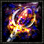

**Handle click events:** 
- [x] When you click an attack button:
    - [x] update_state_variable to make the fungus lose hit points
    - [x] also update your attack points.

## Attacks

###  Arcane Scepter

    - **AP Cost:** 12
    - **HP Damage:** 14

###  Entangle

    - **AP Cost:** 23
    - **HP Damage:** 9

###  Dragon Blade

    - **AP Cost:** 38
    - **HP Damage:** 47

###  Star Fire

    - **AP Cost:** 33
    - **HP Damage:** 25

**Render state changes to the DOM**
    - [x] Update the text above the attack buttons (eg, "100 AP")
    - [x] Update the text above the enemy fungus (eg, "100 HP")
    - [] If Fungus runs out of HP replace the 'walk' class with a 'dead' class
    - [] if you run out of AP replace the 'walk' class with the 'jump' class
    - [] if AP is '0'. Give all of the attack buttons a [`disabled`](https://www.w3schools.com/tags/att_button_disabled.asp) attribute, so they may no longer be used.

